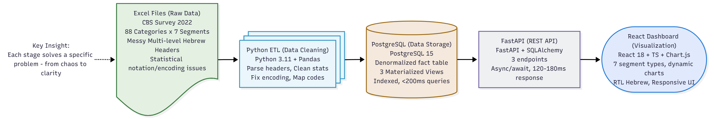
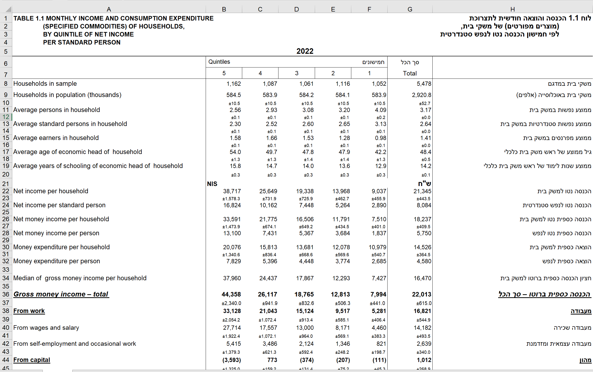
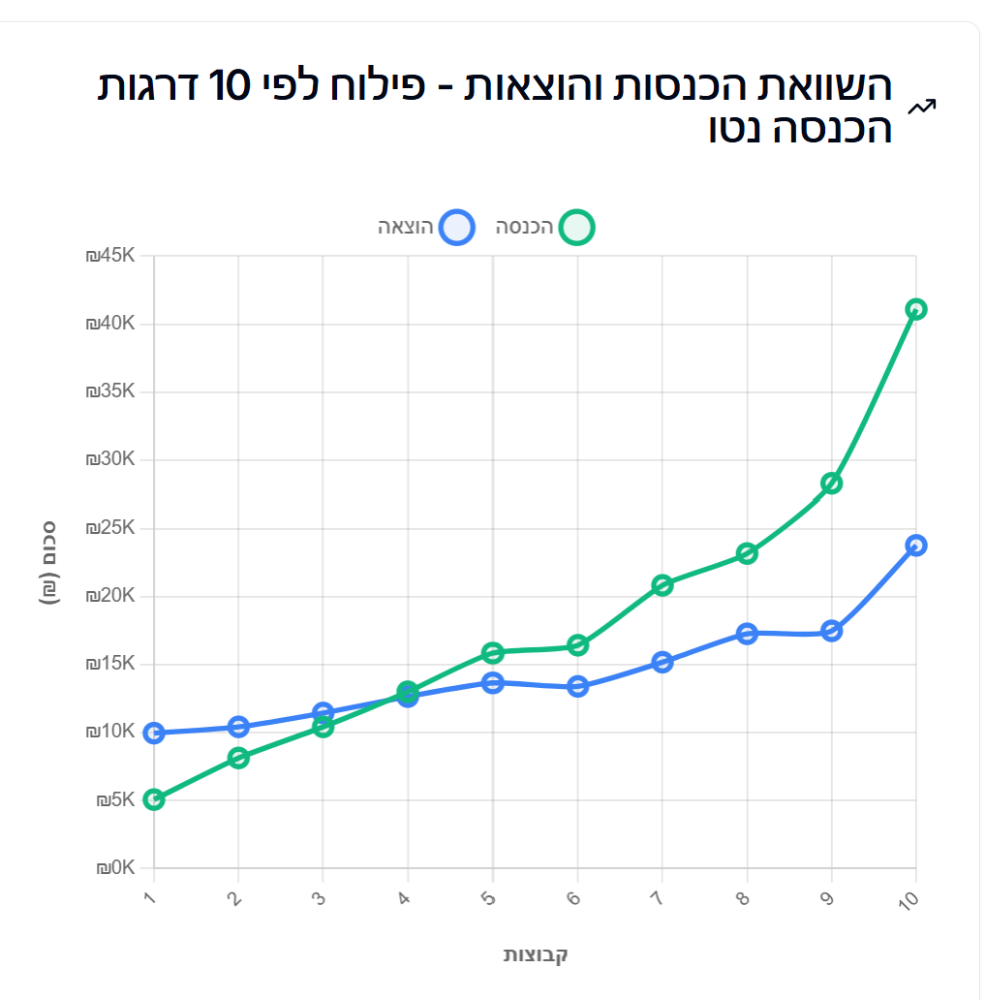
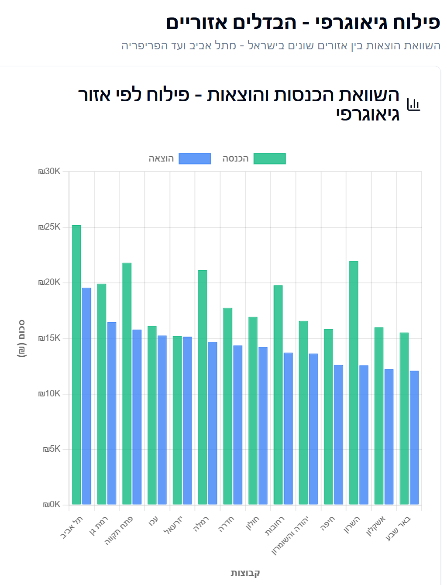
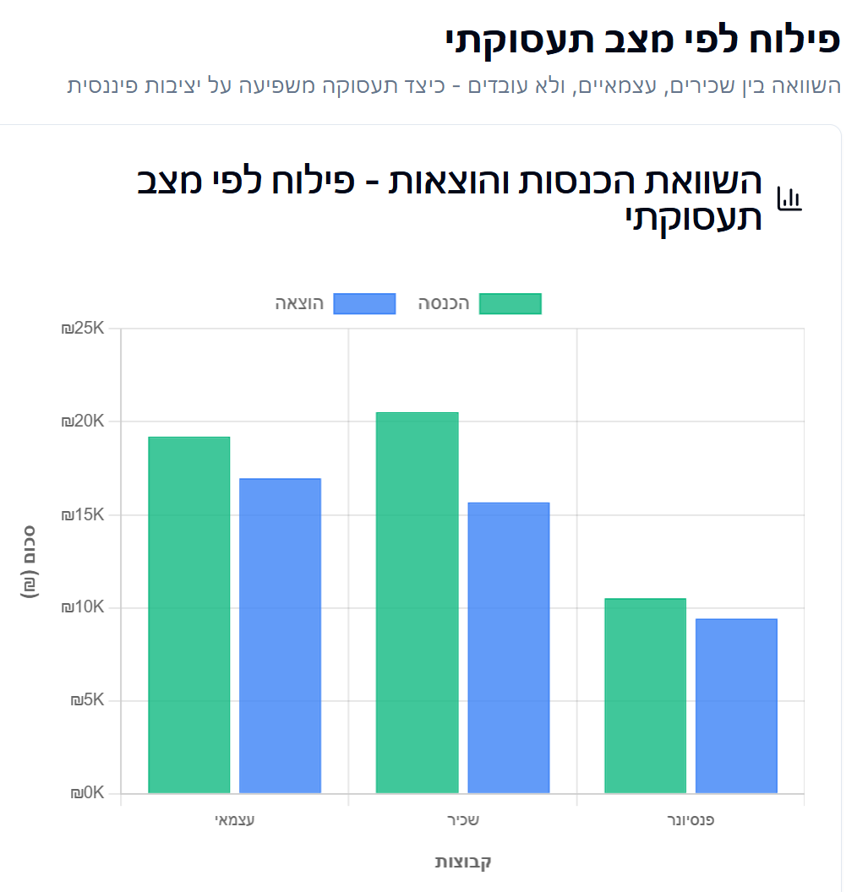
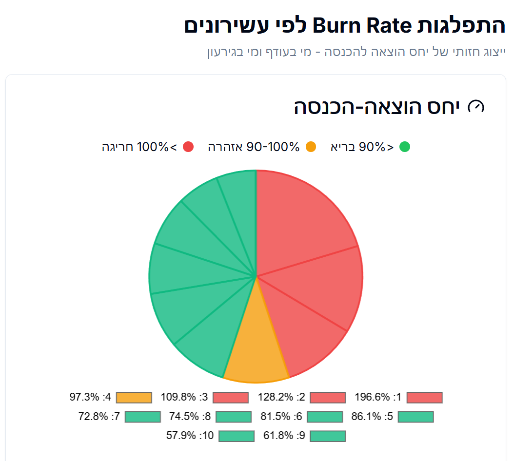

# MarketPulse

## 🛠️ Technology Stack

[](https://www.python.org/)
[](https://fastapi.tiangolo.com/)
[](https://react.dev/)
[](https://www.typescriptlang.org/)
[](https://www.postgresql.org/)
[](https://www.docker.com/)
[](backend/tests/TEST_COVERAGE_STATUS.md)
[](backend/tests/TEST_COVERAGE_STATUS.md)


### פלטפורמת אנליטיקה לניתוח הוצאות משקי בית ישראליים


> *פלטפורמה אינטראקטיבית לניתוח מעמיק של 6,420 משקי בית ישראליים - נתוני הלמ"ס 2022*

---

## 🎯 למה הפרויקט הזה?

כמתכנת שרוצה להיכנס לעולם ה-**Data Analysis**, בחרתי לבנות פרויקט שמדגים את המסע שלי מקוד לתובנות עסקיות.

### האתגר שבחרתי
עבדתי עם **נתוני הלמ"ס הגולמיים** - קבצי אקסל מסורבלים עם:
- כותרות מרובות רמות בעברית
- ערכים סטטיסטיים מורכבים (`5.8±0.3`, `..`, `(42.3)`)
- קידוד Windows-1255 שגורם לבעיות תצוגה
- **קודים מספריים במקום טקסט** - כמו `'471'` במקום "ירושלים", הדורש מיפוי נפרד
- 88 קטגוריות מוצרים × 7 פילוחים דמוגרפיים = אלפי שורות גולמיות

**מטרה:** להפוך את הבלאגן הזה לסיפור ברור עם תובנות עסקיות מעשיות.

### מה למדתי בדרך

**1. ניקוי וטיפול בנתונים (ETL)**
- Python + Pandas לעיבוד קבצים מורכבים
- Regex patterns לזיהוי ופירוק כותרות היררכיות
- טיפול בקידודי עברית והמרות UTF-8
- ולידציות והתאמות טיפוסים

**2. בסיס נתונים מתקדם**
```
Excel גולמי → Python ETL → PostgreSQL → FastAPI → React Dashboard
```
- עברתי מ-SQL Server ל-**PostgreSQL** (חוויה חדשה לחלוטין!)
- Stored Procedures ו-Materialized Views לביצועים
- אינדקסים חכמים לשאילתות מהירות (< 200ms)
- Connection Pooling למניעת עומס

**3. Docker וקונטיינריזציה**
- הקמת סביבת פיתוח עם PostgreSQL + Redis
- Multi-stage builds להקטנת גודל תמונה (180MB במקום 1GB+)
- Docker Compose לניהול מיקרו-שירותים
- **נקודת כניסה לעולם Cloud** - הבנה עמוקה של containers

**4. ויזואליזציה ו-Storytelling**
- React + TypeScript + Chart.js
- תמיכה מלאה ב-RTL (Right-to-Left) לעברית
- **פתרתי באג שקט ב-Chart.js**: `layout="horizontal"` כשל עם RTL → מעבר ל-Vertical Bars
- 7 סוגי פילוח שונים עם גרפים מותאמים (Line, Bar, Pie)
- תובנות עסקיות בצד כל גרף

---

## 📊 הצינור המלא: מאקסל לתובנות



### שלב 1: חילוץ וניקוי (ETL Pipeline)
```python
# backend/etl/extract_table_1_1.py
def parse_cbs_headers(excel_path):
    """
    מטפל בכותרות מרובות רמות (שורות 7-9):
    - רמה 1: קטגוריה ראשית (עברית)
    - רמה 2: תת-קטגוריה (אנגלית)
    - רמה 3: יחידת מידה (₪)
    """
    # קרא את 9 השורות הראשונות
    # זהה היכן מתחילים הנתונים האמיתיים
    # בנה מבנה ניקוי דינמי
```

**דוגמה למה שקורה:**
```
שורה 1: "טבלה 1.1 - הוצאה לתצרוכת למשק בית"
שורה 2-6: מטא-דאטה (מקור, תאריך, הגדרות)
שורה 7: "מזון ומשקאות (לא אלכוהוליים)"
שורה 8: "Food and non-alcoholic beverages"
שורה 9: "הוצאה חודשית ממוצעת (ש״ח)"
שורה 10: Q1    Q2    Q3    Q4    Q5
         1234  2345  3456  4567  5678  ← זה מה שאנחנו רוצים!
```



**אתגרים שפתרתי:**
- ❌ `"5.8±0.3"` → ✅ `5.8` (הסרת שגיאות תקן)
- ❌ `".."` → ✅ `NULL` (נתונים מדוכאים)
- ❌ `"(42.3)"` → ✅ `42.3` (אמינות נמוכה, אך שמיר)
- ❌ `"מזון ומשקאות"` מוצג כ-`"תֶּק×ֶ–×"` → ✅ תיקון קידוד

### שלב 2: טעינה למסד נתונים (PostgreSQL)
```sql
-- backend/models/schema_v10.sql

-- טבלת עובדות דה-נורמלית (Denormalized Fact Table) - מותאמת לביצועי Materialized Views
CREATE TABLE fact_segment_monthly_spending (
    segment_id      INT PRIMARY KEY,
    segment_type    VARCHAR(100),
    segment_value   VARCHAR(100),
    income          DECIMAL(10,2),
    spending        DECIMAL(10,2),
    burn_rate_pct   DECIMAL(5,2),
    surplus_deficit DECIMAL(10,2)
);

-- Materialized View לביצועים
CREATE MATERIALIZED VIEW vw_burn_rate_analysis AS
SELECT
    segment_type,
    segment_value,
    income,
    spending,
    ROUND((spending / NULLIF(income, 0)) * 100, 1) AS burn_rate_pct,
    CASE
        WHEN burn_rate_pct > 100 THEN 'גירעון'
        WHEN burn_rate_pct > 90 THEN 'אזהרה'
        ELSE 'עודף'
    END AS financial_status
FROM fact_segment_monthly_spending;

-- רענון מהיר (< 100ms)
REFRESH MATERIALIZED VIEW CONCURRENTLY vw_burn_rate_analysis;
```

**למה Denormalized Fact Table?**
- שאילתות פשוטות ומהירות (< 200ms)
- אגרגציות קלות עם Materialized Views
- מותאם לאנליטיקה, לא OLTP

### שלב 3: API Layer (FastAPI)
```python
# backend/api/v10_endpoints.py
@router.get("/burn-rate/{segment_type}")
async def get_burn_rate_analysis(segment_type: str):
    """
    מחזיר ניתוח burn rate לפי סוג פילוח:
    - Income Decile (Net): 10 עשירונים
    - Geographic Region: 7 אזורים
    - Work Status: שכיר/עצמאי/לא עובד
    וכו'...

    Response time: < 150ms (materialized view)
    """
    query = "SELECT * FROM vw_burn_rate_analysis WHERE segment_type = %s"
    results = await db.fetch_all(query, values=[segment_type])
    return {"segment_type": segment_type, "burn_rates": results}
```

**ביצועים:**
- ✅ `/api/v10/segment-types`: **~5ms** (רשימת 7 פילוחים)
- ✅ `/api/v10/burn-rate/Income Decile (Net)`: **~120ms** (10 עשירונים + חישובים)
- ✅ `/api/v10/inequality/Country of Birth`: **~180ms** (88 קטגוריות × 4 קבוצות)

### שלב 4: Frontend Dashboard (React + Chart.js)
```typescript
// frontend/src/components/v10/SegmentComparisonChart.tsx
export const SegmentComparisonChart = ({ data, segmentType }) => {
  // מיון דינמי: Income Decile = מספרי, Geographic = לפי הוצאה
  const sortedData = segmentType === 'Income Decile (Net)'
    ? [...data].sort((a, b) => parseInt(a.segment_value) - parseInt(b.segment_value))
    : [...data].sort((a, b) => b.spending - a.spending);

  const chartData = {
    labels: sortedData.map(item => translateSegmentCode(item.segment_value, segmentType)),
    datasets: [
      { label: 'הכנסה', data: sortedData.map(d => d.income), borderColor: 'green' },
      { label: 'הוצאה', data: sortedData.map(d => d.spending), borderColor: 'blue' }
    ]
  };

  return (
    <Card dir="rtl">
      <CardContent>
        <Line data={chartData} options={{ responsive: true, rtl: true }} />
        <p className="text-sm">
          💡 קו ירוק = הכנסה | קו כחול = הוצאה | הפער = יכולת חיסכון
        </p>
      </CardContent>
    </Card>
  );
};
```

**רספונסיביות מלאה:**
- Desktop: תצוגה רחבה עם sidebar
- Mobile: תפריט מתקפל, גרפים מותאמים
- RTL Support: עברית מימין לשמאל בכל הרכיבים

---

## 🔍 תובנות עסקיות מרכזיות

### 1. אי-שוויון קיצוני: פער פי 8 בין עשירונים


```
D10 (10% העליונים): ₪45.1K חודשי
D1  (10% התחתונים):  ₪5.6K חודשי

פער: ×8.0
```
**מה זה אומר?**
- העשירון העליון מרוויח כמו 8 משקי בית בעשירון התחתון
- D10 חוסך 25% מההכנסה (burn rate 75%)
- D1 מוציא יותר מהכנסתו (burn rate 197%) = חיים בחובות

**אינסייט לעסקים:** 30% העליונים (D8-D10) אחראים ל-60% מכלל ההוצאות הצרכניות

---

### 2. פער גיאוגרפי: מרכז vs. פריפריה


```
תל אביב:     ₪20.2K | burn rate 82% (חוסכים 18%)
הצפון:       ₪13.4K | burn rate 91% (חוסכים 9%)
הדרום:       ₪12.1K | burn rate 94% (בקושי חוסכים)

פער: ×1.7
```
**אינסייט:** אסטרטגיית שיווק אחת לכל הארץ = כישלון מובטח

---

### 3. מצב תעסוקתי = יציבות כלכלית (או לא)


```
שכירים:     burn rate 77%  (יציבות)
עצמאים:     burn rate 147% (אי-יציבות כרונית!)
לא עובדים:  burn rate 102% (תמיכת משפחה/קצבאות)
```
**אינסייט:** עצמאים = כוח קנייה גבוה אבל סיכון פיננסי אדיר

---

## 💻 טכנולוגיות

### Backend


- **Python 3.11** - ETL + API
- **FastAPI** - REST endpoints
- **PostgreSQL 15** - Database (חדש עבורי! הרגלתי ל-SQL Server)
- **Pandas** - Data processing
- **SQLAlchemy** - ORM

### Frontend


- **React 18 + TypeScript**
- **Chart.js** - Line/Bar/Pie charts
- **Tailwind CSS** - Styling
- **TanStack Query** - Data fetching
- **Vite** - Build tool

### Infrastructure


- **Docker Compose** - PostgreSQL + Redis containers
- **Multi-stage builds** - Optimized images (180MB)

---

## 📁 מבנה הפרויקט

```
MarketPulse/
├── backend/
│   ├── etl/
│   │   ├── extract_table_1_1.py      # חילוץ טבלה 1.1 (עשירונים)
│   │   ├── extract_table_40.py       # חילוץ טבלה 40 (ערוצי רכישה)
│   │   └── load_strategic_data.py    # טעינה ל-PostgreSQL
│   ├── api/
│   │   ├── main.py                   # FastAPI app
│   │   └── v10_endpoints.py          # 3 endpoints מרכזיים
│   ├── models/
│   │   ├── schema_v10.sql            # Star schema + views
│   │   └── database.py               # Connection pooling
│   └── tests/
│       └── test_v10_api.py           # 15 integration tests
├── frontend/
│   ├── src/
│   │   ├── pages/
│   │   │   ├── DashboardV10.tsx      # דף ראשי
│   │   │   └── AllCharts.tsx         # כל הגרפים במקום אחד
│   │   ├── components/v10/
│   │   │   ├── SegmentComparisonChart.tsx  # Line chart
│   │   │   ├── CategoryComparisonChart.tsx # Bar chart
│   │   │   ├── BurnRateGauge.tsx           # Pie chart
│   │   │   ├── MetricCards.tsx             # KPI cards
│   │   │   └── InsightsList.tsx            # תובנות עסקיות
│   │   ├── hooks/
│   │   │   └── useCBSDataV10.ts      # React Query hooks
│   │   └── utils/
│   │       ├── segmentCodeTranslation.ts  # תרגום קודי פילוח
│   │       └── segmentDisplayNames.ts     # שמות תצוגה בעברית
│   └── package.json
├── CBS Household Expenditure Data Strategy/
│   ├── הוצאה לתצרוכת למשק בית.xlsx         # טבלה 1.1
│   ├── רכישות מוצרים נבחרים לפי אופן.xlsx   # טבלה 40
│   └── הוצאה למזון לפי סוג חנות.xlsx         # טבלה 38
├── docker-compose.yml
└── README.md (אתה כאן!)
```

---

## 🚀 התקנה והרצה

### דרישות מקדימות
- Python 3.11+
- Node.js 18+
- Docker Desktop
- Git

### התקנה מהירה

```bash
# 1. שכפול הפרויקט
git clone https://github.com/Lerner98/MarketPulse.git
cd MarketPulse

# 2. הרצת Docker (PostgreSQL + Redis)
docker-compose up -d

# 3. התקנת Backend
python -m venv venv
source venv/bin/activate  # Windows: venv\Scripts\activate
pip install -r backend/requirements.txt

# 4. הרצת ETL (טעינת נתונים)
python backend/etl/load_strategic_data.py

# 5. הרצת Backend API
cd backend
uvicorn api.main:app --reload --port 8000

# 6. התקנת Frontend (בטרמינל נפרד)
cd frontend
npm install
npm run dev
```

---

### 4. ניתוח Burn Rate - ויזואליזציה של יציבות פיננסית



**מה זה Burn Rate?**
- יחס הוצאה-להכנסה מבוסס אחוזים
- < 90% = חיסכון בריא (ירוק)
- 90-100% = אזהרה (כתום)
- > 100% = גירעון (אדום)

**למה זה חשוב?**
- מזהה קבוצות בסיכון פיננסי
- מאפשר יעדוד מוצרים ושירותים ממוקדים
- חושף דפוסי התנהגות צרכנית

---

## 🎓 מה למדתי

### Technical Skills
✅ **ETL Pipeline Design** - חילוץ, ניקוי, וולידציה של נתונים מורכבים
✅ **PostgreSQL** - Materialized views, stored procedures, indexing
✅ **Docker** - Containerization, multi-stage builds, docker-compose
✅ **REST API Development** - FastAPI, async/await, response optimization
✅ **Data Visualization** - Chart.js, RTL support, responsive design
✅ **Hebrew/RTL Handling** - Encoding issues, text direction, locale formatting

### Soft Skills
✅ **Problem Solving** - פתרון בעיות קידוד, מבנה נתונים, ביצועים
✅ **Data Storytelling** - הפיכת מספרים לתובנות עסקיות
✅ **Documentation** - כתיבת README מקצועי, הסבר קוד, ארכיטקטורה
✅ **Time Management** - עבודה בשלבים, תעדוף משימות

---

## 👤 יוצר

**Guy Lerner**
Junior Data Analyst & Full-Stack Developer

📧 [guy.lerner98@gmail.com](mailto:guy.lerner98@gmail.com)
💼 [LinkedIn](https://linkedin.com/in/guy-lerner)
🐙 [GitHub](https://github.com/Lerner98)

---

**🚀 הפרויקט מציג:** ETL expertise | PostgreSQL proficiency | Docker containerization | Data visualization | Hebrew/RTL support | Business intelligence

*Built with ❤️ for data analysis portfolio*
